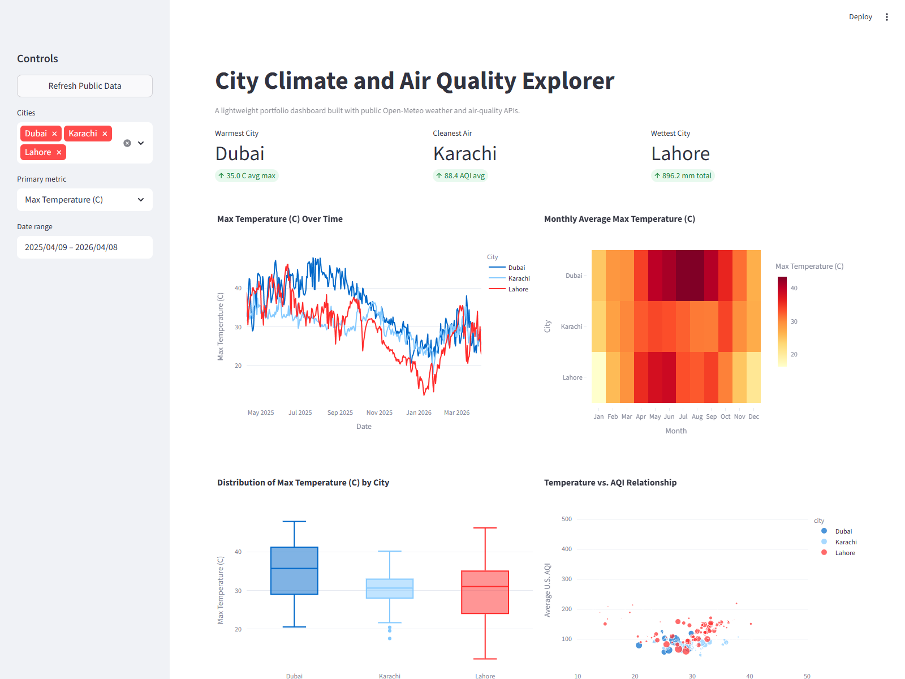

# City Climate and Air Quality Explorer



An interview-ready data science portfolio project focused on public-data ingestion, reusable transformation code, and interactive dashboard storytelling.


## Portfolio snapshot

This project demonstrates the kind of end-to-end work that stands out well in a GitHub portfolio:

- Public API ingestion instead of static CSV-only analysis
- Local caching to keep reruns lightweight and reproducible
- Clean transformation logic that turns raw API responses into dashboard-ready features
- Interactive visuals that help compare cities across weather and air quality
- A polished app layer that can be shown in demos, README previews, and future deployments

## Dashboard preview

The README preview uses the app view shown above so visitors can immediately understand what the project looks like without cloning the repo first.

Good places to showcase these visuals:

- GitHub README with a preview image and short explanation
- LinkedIn project post with 2 to 4 annotated screenshots
- Streamlit Community Cloud or another lightweight deployment for a live demo
- Resume or portfolio website as a linked case study

## What this project answers

The dashboard helps compare a small set of cities across questions such as:

- Which city stays hottest over the year?
- Which cities have cleaner or worse air on average?
- How do seasonal shifts affect temperature and AQI together?
- Which cities experience the heaviest rainfall patterns?
- How do distribution and variability differ, not just the averages?

## Why this project

- Public data only: Open-Meteo provides free geocoding, historical weather, and air-quality APIs.
- Low resource usage: we will fetch a small list of cities and cache the results locally.
- Strong portfolio signal: the project will include a reproducible pipeline, clear visuals, and an interactive dashboard.

## Project goal

Build a dashboard that lets a user compare a handful of cities across:

- temperature trends
- precipitation patterns
- wind conditions
- air quality metrics
- weather vs. AQI relationships

## Planned visuals

- multi-city trend comparisons
- monthly heatmaps
- rolling averages
- distribution plots
- scatter plots for weather and AQI relationships

## Data sources

- Open-Meteo Geocoding API
- Open-Meteo Historical Weather API
- Open-Meteo Air Quality API

## Project structure

```text
.
|-- dashboard/
|-- data/
|   |-- processed/
|   `-- raw/
|-- notebooks/
`-- src/
    `-- climate_dashboard/
```

## Delivery plan

1. Scaffold the repo and environment.
2. Build a small ingestion pipeline with caching.
3. Transform and combine weather and AQI data.
4. Create a dashboard with polished visualizations.
5. Document setup, decisions, and results.

## Quick start

```powershell
uv python install 3.12
uv sync
uv run climate-fetch --lookback-days 365
uv run streamlit run dashboard/app.py
```

## Current implementation

- `src/climate_dashboard/pipeline.py` resolves city coordinates, fetches public weather and air-quality data, and saves local CSV caches.
- `dashboard/app.py` provides an interactive Streamlit dashboard with trend, heatmap, distribution, and relationship views.
- Cached outputs are written to `data/raw/` and `data/processed/` to avoid unnecessary repeated API calls.

## Tech stack

- `pandas` for transformation and feature engineering
- `requests` for lightweight API access
- `Plotly` for interactive visualization
- `Streamlit` for dashboard delivery
- `uv` for fast environment and dependency management

## Why this is portfolio-strong

- It shows data acquisition, not only notebook analysis.
- It has a clear user-facing output instead of a code-only repository.
- It uses public sources, so reviewers can rerun it themselves.
- It is small enough to explain in an interview but complete enough to feel real.

## Interview talking points

- Why a cache-first design matters for public APIs and reproducibility
- How daily weather and hourly AQI data were normalized into one analytical table
- Why city selection and metric filters make the dashboard more useful than static charts
- What you would add next, such as deployment, scheduled refreshes, or more cities

## Suggested development cadence

- Session 1: scaffold repo and environment
- Session 2: add data ingestion and caching
- Session 3: add transformations and quality checks
- Session 4: build dashboard visuals
- Session 5: polish docs and screenshots

## Commit plan

We will keep the history clean and realistic with small commits such as:

1. `chore: scaffold climate dashboard project`
2. `feat: add Open-Meteo data ingestion pipeline`
3. `feat: build weather and AQI transformation layer`
4. `feat: add interactive Streamlit dashboard`
5. `docs: document setup, data sources, and project story`

I will avoid fake or backdated commits. A better approach is a recurring reminder to make one intentional commit per work session.
